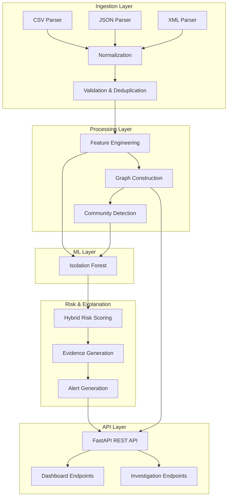

# Bitcoin Forensic Intelligence System

An offline Linux-compatible backend system for Bitcoin forensic analysis that ingests bulk transaction/network metadata, correlates network-layer observations with blockchain data, constructs entity/transaction graphs, applies ML for anomaly detection, and generates ranked investigative leads with explainable confidence scores.

## Problem Statement

Build an offline system that:
- Ingests Bitcoin transaction/network metadata from CSV/JSON/XML
- Correlates IP/port/timing observations with wallet/TXID/amount data
- Constructs heterogeneous entity/transaction graphs
- Applies AI/ML for anomaly detection and entity clustering
- Generates ranked, explainable investigative leads with confidence scores

## Architecture



## Tech Stack

- **Python 3.11+**
- **FastAPI** - REST API framework
- **Uvicorn** - ASGI server
- **Pydantic** - Data validation
- **Pandas/Polars** - Data processing
- **NetworkX** - Graph operations
- **scikit-learn** - ML (Isolation Forest)
- **SQLAlchemy + SQLite** - Local persistence
- **joblib** - Model serialization

## Installation

### Local Development

```bash
# Clone and enter directory
cd bitcoin-forensics

# Run setup script (creates venv, installs deps, generates data, trains model, starts server)
./run.sh all

# Or run individual steps:
./run.sh generate    # Generate synthetic dataset only
./run.sh train       # Run full pipeline (ingest, features, graph, train)
./run.sh serve       # Start API server only
```

### Docker

```bash
# Build and start API
docker-compose up --build api

# Run pipeline (generates data, processes, trains model)
docker-compose --profile pipeline up pipeline

# Or run everything
docker-compose up --build
```

## Configuration

All configuration via environment variables (see `.env.example`):

| Variable | Default | Description |
|----------|---------|-------------|
| `MAX_UPLOAD_SIZE` | 100MB | Max file upload size |
| `ML_CONTAMINATION` | 0.1 | Isolation Forest contamination |
| `ML_N_ESTIMATORS` | 100 | Number of trees |
| `RISK_ML_ANOMALY_WEIGHT` | 0.30 | ML anomaly weight in risk score |
| `RISK_GRAPH_WEIGHT` | 0.20 | Graph anomaly weight |
| `RISK_TEMPORAL_WEIGHT` | 0.20 | Temporal anomaly weight |
| `RISK_NETWORK_WEIGHT` | 0.15 | Network correlation weight |
| `RISK_BEHAVIOR_WEIGHT` | 0.15 | Behavioral indicator weight |
| `RISK_LOW_THRESHOLD` | 0.25 | LOW risk threshold |
| `RISK_MEDIUM_THRESHOLD` | 0.50 | MEDIUM risk threshold |
| `RISK_HIGH_THRESHOLD` | 0.75 | HIGH risk threshold |

## Dataset Format

### Supported Fields

```json
{
  "timestamp": "2024-01-15T10:30:00Z",
  "txid": "a1b2c3d4...",
  "input_addresses": ["1A1zP1eP5QGefi2DMPTfTL5SLmv7DivfNa"],
  "output_addresses": ["1BvBMSEYstWetqTFn5Au4m4GFg7xJaNVN2"],
  "input_amounts": [0.5, 0.3],
  "output_amounts": [0.75],
  "fee": 0.0001,
  "script_type": "P2PKH",
  "src_ip": "192.168.1.100",
  "dst_ip": "10.0.0.50",
  "src_port": 54321,
  "dst_port": 8333,
  "geo_country": "US",
  "asn": "AS15169"
}
```

### Ingestion Report

```json
{
  "dataset_id": "uuid",
  "total_records": 100000,
  "valid_records": 98231,
  "invalid_records": 1769,
  "duplicates": 230,
  "warnings": ["Missing required field: fee in 5 records"]
}
```

## API Endpoints

### Health
- `GET /api/health` - System health check

### Datasets
- `POST /api/datasets/upload` - Upload dataset file
- `POST /api/datasets/{id}/process` - Process uploaded dataset
- `GET /api/datasets` - List datasets
- `GET /api/datasets/{id}` - Get dataset info
- `DELETE /api/datasets/{id}` - Delete dataset

### Entities (Wallets)
- `GET /api/entities/dataset/{id}` - List wallets (paginated)
- `GET /api/entities/dataset/{id}/top` - Top risky wallets
- `GET /api/entities/{address}` - Get wallet details

### Transactions
- `GET /api/transactions/dataset/{id}` - List transactions
- `GET /api/transactions/dataset/{id}/{txid}` - Get transaction

### Graph
- `GET /api/graph/entity/{address}` - Get k-hop neighborhood
- `GET /api/graph/path` - Shortest path between wallets
- `GET /api/graph/components` - Connected components

### ML
- `POST /api/ml/train` - Train anomaly detection model
- `POST /api/ml/predict` - Generate anomaly predictions
- `GET /api/ml/status` - Model status
- `GET /api/ml/features` - Model feature names
- `GET /api/ml/models` - List trained models
- `POST /api/ml/load` - Load specific model

### Alerts
- `GET /api/alerts/dataset/{id}` - List alerts (paginated, filterable)
- `GET /api/alerts/dataset/{id}/stats` - Alert statistics
- `GET /api/alerts/top` - Top alerts across dataset

### Investigations
- `GET /api/investigations/{address}` - Full investigation for entity
- `GET /api/investigations/{address}/summary` - Quick summary

### Dashboard
- `GET /api/dashboard/summary` - Overall statistics
- `GET /api/dashboard/top-alerts` - Top alerts
- `GET /api/dashboard/top-wallets` - Top risky wallets
- `GET /api/dashboard/risk-distribution` - Risk level distribution
- `GET /api/dashboard/transaction-volume` - Transaction volume over time

## ML Approach

### Isolation Forest (Primary)

Unsupervised anomaly detection on wallet behavioral features:
- **Features**: 22 dimensions (transaction, behavioral, graph, flow, network)
- **Training**: Local, offline, deterministic (seed=42)
- **Output**: Anomaly score normalized to [0,1]
- **Persistence**: joblib serialization

### Hybrid Risk Score

```
Risk = 0.30 × ML_Anomaly + 0.20 × Graph + 0.20 × Temporal + 0.15 × Network + 0.15 × Behavioral
```

All components normalized to [0,1]. Weights configurable.

### Risk Levels
- **LOW**: 0.00–0.24
- **MEDIUM**: 0.25–0.49
- **HIGH**: 0.50–0.74
- **CRITICAL**: 0.75–1.00

## Explainability

Every alert includes structured evidence:

```json
{
  "entity_id": "wallet_abc123",
  "risk_score": 0.93,
  "risk_level": "CRITICAL",
  "reasons": [
    {
      "signal": "transaction_velocity",
      "description": "17 transactions within 4 minutes",
      "contribution": 0.21,
      "evidence_type": "observed"
    },
    {
      "signal": "fan_out",
      "description": "Transferred to 11 unique counterparties",
      "contribution": 0.18,
      "evidence_type": "observed"
    },
    {
      "signal": "graph_centrality",
      "description": "Unusually high PageRank (0.0023)",
      "contribution": 0.16,
      "evidence_type": "model_derived"
    }
  ]
}
```

Evidence types:
- `observed` - Directly measurable from data
- `model_derived` - From ML model output
- `heuristic` - Rule-based indicators
- `correlation` - IP-transaction correlations

## Graph Model

### Node Types
- `WALLET` - Bitcoin addresses
- `TRANSACTION` - Transaction IDs
- `IP` - Network IP addresses
- `ASN` - Autonomous System Numbers
- `COUNTRY` - Geographic countries

### Edge Types
- `INPUT` / `OUTPUT` - Wallet ↔ Transaction
- `OBSERVED_SOURCE` / `OBSERVED_DEST` - IP ↔ Transaction
- `BELONGS_TO_ASN` - IP → ASN
- `LOCATED_IN` - IP → Country
- `TRANSFER` - Wallet → Wallet (via transaction)

### Queries Supported
- k-hop neighborhood
- Shortest path
- Connected components
- Community detection (Louvain/Greedy/Label Propagation)
- Transaction flow tracing

## Synthetic Data Generator

```bash
python scripts/generate_dataset.py \
  --transactions 100000 \
  --wallets 30000 \
  --days 30 \
  --format json \
  --output data/sample/dataset.json
```

Generates scenarios:
1. Normal activity
2. Burst activity (rapid successive transactions)
3. Fan-out (one-to-many distribution)
4. Fan-in (many-to-one consolidation)
5. Layering/peeling chains
6. Geographic anomalies
7. Shared infrastructure (multiple wallets, same IP)

Ground truth labels saved separately for evaluation only.

## Model Evaluation

```bash
python scripts/evaluate.py --dataset-id <id> --labels data/sample/dataset.labels.json
```

Metrics:
- Top-K Precision (K=10, 20, 50)
- Precision/Recall/F1 (if labels available)
- PR-AUC

## Ablation Testing

Compare feature set contributions:
1. Transaction-only
2. Transaction + Temporal
3. Transaction + Graph
4. Transaction + Network
5. Full feature set

## Offline Operation

✅ No external APIs required at runtime  
✅ No blockchain explorers  
✅ No cloud ML services  
✅ All models run locally  
✅ GeoIP optional (graceful degradation)  
✅ SQLite for local persistence  

## Security & Validation

- Input validation on all endpoints
- File size limits (configurable)
- Path traversal protection
- Malformed data handling
- IP/timestamp validation
- No sensitive data logging
- Structured error responses

## Testing

```bash
# Run all tests
pytest tests/ -v

# With coverage
pytest tests/ --cov=app --cov-report=html

# Specific test modules
pytest tests/test_ingestion.py -v
pytest tests/test_ml.py -v
pytest tests/test_graph.py -v
```

Target: 70%+ coverage on core services.

## Project Structure

```
bitcoin-forensics/
├── app/
│   ├── main.py                 # FastAPI app entry
│   ├── api/routes/             # REST endpoints
│   ├── core/                   # Config, logging, exceptions
│   ├── models/schemas.py       # Pydantic models
│   ├── services/               # Business logic
│   │   ├── ingestion_service.py
│   │   ├── feature_service.py
│   │   ├── risk_service.py
│   │   ├── correlation_service.py
│   │   └── explanation_service.py
│   ├── ml/                     # ML components
│   │   ├── anomaly_detector.py
│   │   ├── clustering.py
│   │   ├── feature_engineering.py
│   │   └── model_registry.py
│   ├── graph/                  # Graph operations
│   │   ├── builder.py
│   │   ├── analytics.py
│   │   └── community_detection.py
│   ├── ingestion/              # Data parsers
│   │   ├── csv_parser.py
│   │   ├── json_parser.py
│   │   ├── xml_parser.py
│   │   └── validator.py
│   └── db/                     # Database layer
│       ├── database.py
│       └── repository.py
├── data/                       # Data directories
├── scripts/                    # CLI tools
│   ├── generate_dataset.py
│   ├── train_model.py
│   └── run_pipeline.py
├── tests/                      # Unit tests
├── requirements.txt
├── Dockerfile
├── docker-compose.yml
├── .env.example
└── run.sh
```

## Domain Limitations

**IMPORTANT**: This system is designed for investigative prioritization only.

1. **IP-to-wallet correlation ≠ ownership proof** - Shared IPs, NAT, VPNs, proxies create false correlations
2. **Risk score ≠ criminal proof** - Anomaly detection flags unusual patterns, not illegal activity
3. **Synthetic data ≠ real-world accuracy** - Generated data for testing only
4. **Network metadata may be incomplete** - Observations depend on collection points
5. **Human review required** - System produces leads for investigator triage

## Ethical Considerations

- No automatic criminal classification
- Correlation confidence explicitly stated
- Designed for lawful investigation support
- No PII stored beyond public blockchain data
- Audit trail for all analytical decisions

## Recommended Next Steps for Frontend

1. **Dashboard**: Consume `/api/dashboard/*` for overview cards and charts
2. **Alert Triage**: Use `/api/alerts/top` with pagination for alert queue
3. **Investigation View**: `/api/investigations/{id}` for detail page
4. **Graph Visualization**: `/api/graph/entity/{id}` with depth parameter for network graph
5. **Timeline**: `/api/investigations/{id}` includes timeline for chronological view
6. **ML Monitoring**: `/api/ml/status` for model health indicator

## License

MIT License - See LICENSE file for details.