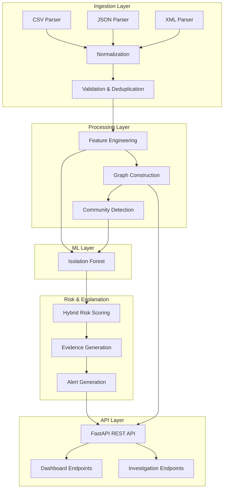

# Bitcoin Forensic Intelligence System

An offline Linux-compatible backend system for Bitcoin forensic analysis that ingests bulk transaction/network metadata, correlates network-layer observations with blockchain data, constructs entity/transaction graphs, applies ML for anomaly detection, and generates ranked investigative leads with explainable confidence scores.

## Problem Statement

Build an offline system that:
- Ingests Bitcoin transaction/network metadata from CSV/JSON/XML
- Correlates IP/port/timing observations with wallet/TXID/amount data
- Constructs heterogeneous entity/transaction graphs
- Applies AI/ML for anomaly detection and entity clustering
- Generates ranked, explainable investigative leads with confidence scores

## Architecture



## Tech Stack

- **Python 3.11+**
- **FastAPI** - REST API framework
- **Uvicorn** - ASGI server
- **Pydantic** - Data validation
- **Pandas/Polars** - Data processing
- **NetworkX** - Graph operations
- **scikit-learn** - ML (Isolation Forest)
- **SQLAlchemy + SQLite** - Local persistence
- **joblib** - Model serialization
- **geoip2** - Offline GeoIP lookup (MaxMind GeoLite2)

## Quick Start (Linux)

### Prerequisites
- Python 3.11+
- Node.js 18+ (for frontend)
- Git

### 1. Clone Repository
```bash
git clone <repository-url>
cd bitcoin-forensics
```

### 2. Python Environment & Backend Dependencies
```bash
# Create virtual environment
python3 -m venv .venv
source .venv/bin/activate

# Upgrade pip
pip install --upgrade pip

# Install backend dependencies
pip install -r requirements.txt
```

### 3. Frontend Dependencies
```bash
cd frontend
npm install
cd ..
```

---

## ONLINE ONE-TIME PROVISIONING (before going offline)

### GeoLite2 Database Provisioning

**The application does NOT download GeoIP data at runtime.** You must provision the MaxMind GeoLite2 database *before* going offline.

#### 1. Obtain MaxMind License Key (free)
1. Create a free account at https://www.maxmind.com/en/geolite2/signup
2. Generate a license key at https://www.maxmind.com/en/accounts/current/license-key

#### 2. Download and Install Database
```bash
# Set your license key
export MAXMIND_LICENSE_KEY="your_license_key_here"

# Run the setup script (downloads GeoLite2-Country.mmdb and GeoLite2-ASN.mmdb)
python3 scripts/setup_geoip.py
```

**Expected database location:**
```
bitcoin-forensics/
└── data/
    └── geoip/
        ├── GeoLite2-Country.mmdb   # Required
        └── GeoLite2-ASN.mmdb       # Optional (enables ASN lookups)
```

**If you cannot use the script**, manually download from:
- https://dev.maxmind.com/geoip/geolite2-free-geolocation-data
- Place `.mmdb` files in `data/geoip/`

> **Important**: The application does NOT download GeoIP databases at runtime. The database must exist at `data/geoip/GeoLite2-Country.mmdb` before starting the backend. If missing, the GeoIP service gracefully degrades (private IPs → PRIVATE, public IPs → UNKNOWN).

---

## OFFLINE RUNTIME (no internet required)

After provisioning the GeoLite2 database, the application runs entirely offline.

### 5. Backend Startup
```bash
# From project root, with virtual environment activated
source .venv/bin/activate
python3 -m uvicorn app.main:app --host 0.0.0.0 --port 8000
```

Backend runs at: `http://localhost:8000`
API docs: `http://localhost:8000/docs`

### 6. Frontend Startup
```bash
cd frontend
npm run dev -- --host 0.0.0.0 --port 5173
```

Frontend runs at: `http://localhost:5173`

---

## 7. Test Execution
```bash
# Run all tests
cd bitcoin-forensics
source .venv/bin/activate
python3 -m pytest tests/ -v

# Run specific test modules
pytest tests/test_ml.py -v
pytest tests/test_graph.py -v
pytest tests/test_risk.py -v
pytest tests/test_comprehensive.py -v
```

---

## 8. Synthetic Ground-Truth Generation
```bash
# Generate deterministic synthetic dataset with ground truth
cd bitcoin-forensics
source .venv/bin/activate
python3 scripts/generate_ground_truth_dataset.py
```

**Output:** `data/ground_truth/`
- `blockchain_ledger.csv` - 863 transactions
- `network_logs.csv` - 863 network observations  
- `ground_truth.csv` - 119 labeled entities (8 pattern types)
- `ground_truth.json` - Machine-readable ground truth

Pattern types included:
- Normal activity (105 entities)
- Peeling chain (1 entity)
- Mixing structure (1 entity)
- High-velocity burst (1 entity)
- Dormant-to-active (5 entities)
- Geographic anomaly (3 entities)
- Shared infrastructure (3 entities)
- False positive cases (5 entities)

---

## 9. Offline Execution Verification

After provisioning the GeoLite2 database and starting services:

1. **Disable internet** (unplug network / disable WiFi)
2. Verify services still run:
   ```bash
   curl http://localhost:8000/api/health
   curl http://localhost:5173
   ```
3. Test full pipeline offline:
   ```bash
   curl "http://localhost:8000/api/investigations/108twQXGLnyHCi6ZECLjPXRLt9h9RDZERx?dataset_id=20561904-53b8-4d00-9068-10762b110611"
   ```

---

## Configuration

### Environment Variables (see `.env.example`)
```bash
# Application
APP_HOST=0.0.0.0
APP_PORT=8000
DEBUG=false

# Data
DATA_DIR=data
RAW_DATA_DIR=data/raw
PROCESSED_DATA_DIR=data/processed
MODELS_DIR=data/models
GEOIP_DATA_DIR=data/geoip

# ML
ML_MODEL_PATH=data/models/anomaly_detector.joblib
ML_RANDOM_SEED=42
ML_CONTAMINATION=0.1
ML_N_ESTIMATORS=100

# Risk Weights
RISK_ML_ANOMALY_WEIGHT=0.30
RISK_GRAPH_WEIGHT=0.20
RISK_TEMPORAL_WEIGHT=0.20
RISK_NETWORK_WEIGHT=0.15
RISK_BEHAVIOR_WEIGHT=0.15

# Risk Thresholds
RISK_LOW_THRESHOLD=0.25
RISK_MEDIUM_THRESHOLD=0.50
RISK_HIGH_THRESHOLD=0.75

# Correlation
CORRELATION_TEMPORAL_WINDOW_SECONDS=300
CORRELATION_MIN_OBSERVATIONS=2
CORRELATION_SCORE_THRESHOLD=0.5

# Risk Propagation
RISK_PROPAGATION_DECAY=0.7
RISK_PROPAGATION_MAX_DEPTH=3

# Database
DATABASE_URL=sqlite:///data/forensics.db
```

### GeoIP Configuration
The GeoIP service looks for databases at:
- `GEOIP_DATA_DIR/GeoLite2-Country.mmdb` (required)
- `GEOIP_DATA_DIR/GeoLite2-ASN.mmdb` (optional)

Default: `data/geoip/` (relative to project root)

Override via environment:
```bash
export GEOIP_DATA_DIR=/custom/path/to/geoip
```

---

## Dataset Format

### Supported Fields
```json
{
  "timestamp": "2024-01-15T10:30:00Z",
  "txid": "a1b2c3d4...",
  "input_addresses": ["1A1zP1eP5QGefi2DMPTfTL5SLmv7DivfNa"],
  "output_addresses": ["1BvBMSEYstWetqTFn5Au4m4GFg7xJaNVN2"],
  "input_amounts": [0.5, 0.3],
  "output_amounts": [0.75],
  "fee": 0.0001,
  "script_type": "P2PKH",
  "src_ip": "192.168.1.100",
  "dst_ip": "10.0.0.50",
  "src_port": 54321,
  "dst_port": 8333,
  "geo_country": "US",
  "asn": "AS15169"
}
```

### Supported Formats
- CSV (streaming for large files > 50MB)
- JSON (streaming for large files > 50MB)
- XML

---

## API Endpoints

### Health
- `GET /api/health` - System health check

### Datasets
- `POST /api/datasets/upload` - Upload dataset file
- `POST /api/datasets/{id}/process` - Process uploaded dataset
- `GET /api/datasets` - List datasets
- `GET /api/datasets/{id}` - Get dataset info
- `DELETE /api/datasets/{id}` - Delete dataset

### Entities (Wallets)
- `GET /api/entities/dataset/{id}` - List wallets (paginated)
- `GET /api/entities/dataset/{id}/top` - Top risky wallets
- `GET /api/entities/{address}` - Get wallet details

### Graph
- `GET /api/graph/entity/{address}` - Get k-hop neighborhood
- `GET /api/graph/path` - Shortest path between wallets
- `GET /api/graph/components` - Connected components

### ML
- `POST /api/ml/train` - Train anomaly detection model
- `POST /api/ml/predict` - Generate anomaly predictions
- `GET /api/ml/status` - Model status
- `GET /api/ml/features` - Model feature names
- `GET /api/ml/models` - List trained models
- `POST /api/ml/load` - Load specific model

### Alerts
- `GET /api/alerts/dataset/{id}` - List alerts (paginated, filterable)
- `GET /api/alerts/dataset/{id}/stats` - Alert statistics
- `GET /api/alerts/top` - Top alerts across dataset

### Investigations
- `GET /api/investigations/{address}` - Full investigation for entity
- `GET /api/investigations/{address}/summary` - Quick summary

### Dashboard
- `GET /api/dashboard/summary` - Overall statistics
- `GET /api/dashboard/top-alerts` - Top alerts
- `GET /api/dashboard/top-wallets` - Top risky wallets
- `GET /api/dashboard/risk-distribution` - Risk level distribution
- `GET /api/dashboard/transaction-volume` - Transaction volume over time

---

## ML Approach

### Isolation Forest (Primary)
Unsupervised anomaly detection on wallet behavioral features:
- **Features**: 23 dimensions (transaction, behavioral, graph, flow, network)
- **Training**: Local, offline, deterministic (seed=42)
- **Output**: Anomaly score normalized to [0,1]
- **Persistence**: joblib serialization

### Structural Detection (Behavioral Heuristics)
Real forensic heuristics, NOT ML:
- **Peeling Chain**: Sequential peel-off of small amounts from large UTXO
- **Mixing-like Structure**: Fan-in/fan-out with uniform outputs
- Features: chain length, temporal gaps, amount progression, change ratios, equal-output ratios

### Hybrid Risk Score
```
Risk = 0.30 × ML_Anomaly + 0.20 × Graph + 0.20 × Temporal + 0.15 × Network + 0.15 × Behavioral
```

### Risk Levels
- **LOW**: 0.00–0.24
- **MEDIUM**: 0.25–0.49
- **HIGH**: 0.50–0.74
- **CRITICAL**: 0.75–1.00

---

## Explainability

Every alert includes structured evidence:
```json
{
  "entity_id": "wallet_abc123",
  "risk_score": 0.93,
  "risk_level": "CRITICAL",
  "reasons": [
    {
      "signal": "transaction_velocity",
      "description": "17 transactions within 4 minutes",
      "contribution": 0.21,
      "evidence_type": "observed"
    },
    {
      "signal": "peeling_chain",
      "description": "Chain length: 8 transactions, avg peel: 0.100 BTC",
      "contribution": 0.17,
      "evidence_type": "heuristic"
    },
    {
      "signal": "ml_feature_fan_out",
      "description": "Feature 'fan_out' increases anomaly score (contribution: 0.0421)",
      "contribution": 0.14,
      "evidence_type": "model_derived"
    }
  ]
}
```

Evidence types:
- `observed` - Directly measurable from data
- `model_derived` - From ML model output
- `heuristic` - Rule-based structural detection
- `correlation` - IP-transaction correlations
- `graph_propagation` - Risk propagated through transaction graph

---

## Testing

```bash
# Run all tests
pytest tests/ -v

# Run specific modules
pytest tests/test_ml.py -v
pytest tests/test_graph.py -v
pytest tests/test_risk.py -v
pytest tests/test_comprehensive.py -v

# With coverage
pytest tests/ --cov=app --cov-report=html
```

Target: 70%+ coverage on core services.

---

## Offline Operation Guarantee

✅ No external APIs required at runtime  
✅ No blockchain explorers  
✅ No cloud ML services  
✅ All models run locally  
✅ GeoIP optional (graceful degradation)  
✅ SQLite for local persistence  
✅ No runtime network calls (GeoIP uses local .mmdb)  
✅ Frontend uses local CSS animations (no CDN video)  
✅ No telemetry/analytics  

---

## Domain Limitations

**IMPORTANT**: This system is designed for investigative prioritization only.

1. **IP-to-wallet correlation ≠ ownership proof** - Shared IPs, NAT, VPNs, proxies create false correlations
2. **Risk score ≠ criminal proof** - Anomaly detection flags unusual patterns, not illegal activity
3. **Synthetic data ≠ real-world accuracy** - Generated data for testing only
4. **Network metadata may be incomplete** - Observations depend on collection points
5. **Human review required** - System produces leads for investigator triage

---

## Ethical Considerations

- No automatic criminal classification
- Correlation confidence explicitly stated
- Designed for lawful investigation support
- No PII stored beyond public blockchain data
- Audit trail for all analytical decisions

---

## License

MIT License - See LICENSE file for details.